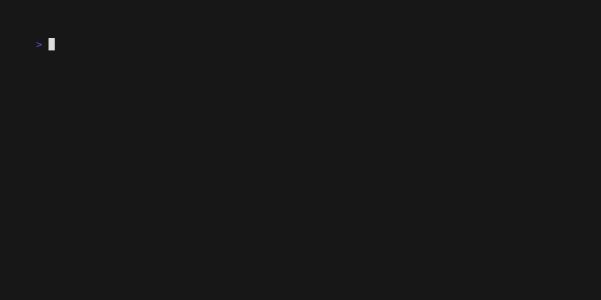

# necli

<p align="center">
A little NodeJS cli script inspired by Dennis Nedry in Jurrassic Park 🦖 </br></br>
<a target="_blank" href="https://www.youtube.com/watch?v=RfiQYRn7fBg"></a>
</p>

## What is the origin of `necli` name ❓

```
Nedry + cli = necli🎉
```

## Tutorial 🤓



To execute this little script you have just to run `necli` command

```bash
necli
```

But you can also display use option

```bash
necli --help
necli --version
```

## Installation ⬇️

To install this little script you have to clone this repository

```bash
git clone https://github.com/Koalhack/necli
```

Go to necli folder

```bash
cd necli
```

Install the dependencies

```bash
yarn install
or
npm install
```

And install it as a global package

```bash
yarn install -g or npm install -g
```

## Dependencies 📦

- [Inquirer.js](https://www.npmjs.com/package/inquirer)
- [Commander.js](https://www.npmjs.com/package/commander)
- [Express](https://www.npmjs.com/package/express)
- [Open](https://www.npmjs.com/package/open)

## License 📓

[MIT](https://github.com/Koalhack/necli/raw/main/LICENSE)
